# DemoWebsite
Demo website showing how Machine Learning models can be integrated into college website to improve students' learning experience.

## Machine Larning Models used:
1. Content Based Recommendation; Recommending similar courses and a suitable job based on student's favourite course.
https://github.com/smsm15/Content-based-Recommendation-System

2. GPA Prediction: https://github.com/smsm15/improve_education_v1.0.0
 
 
### Screenshots

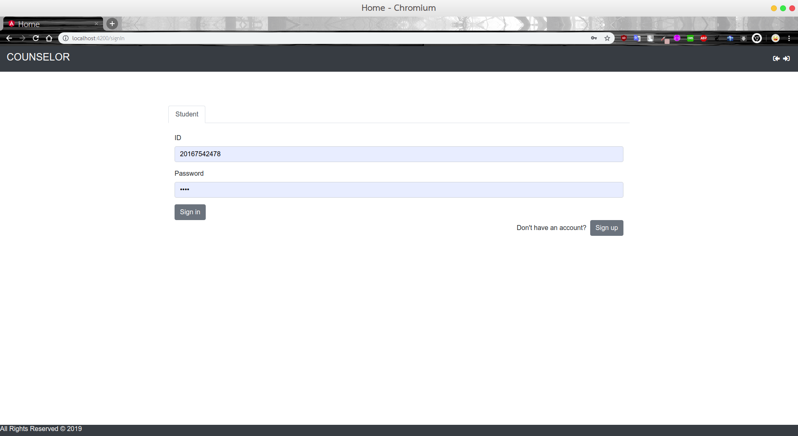
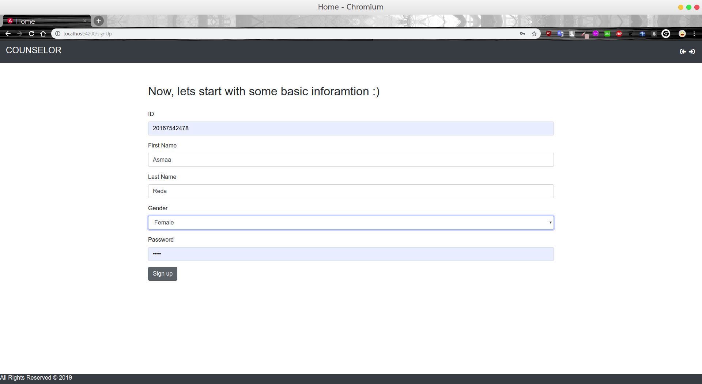
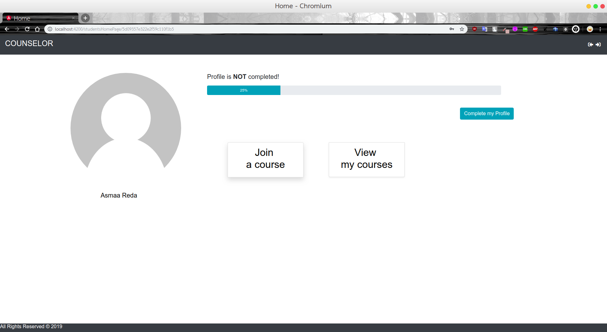
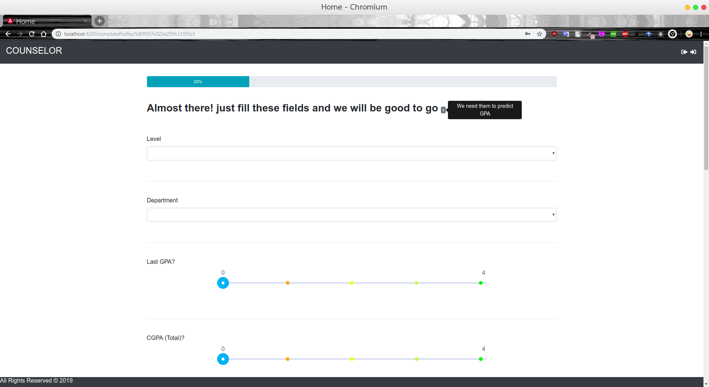
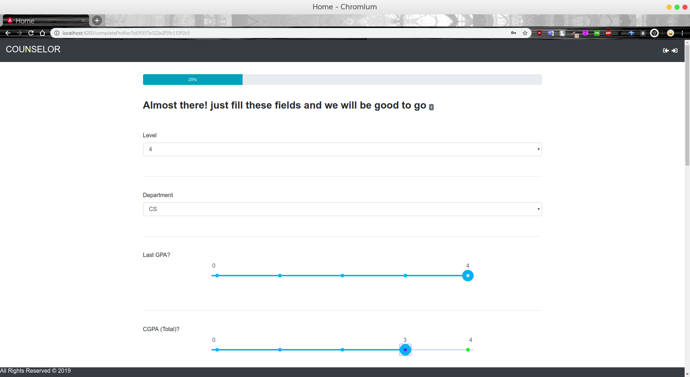
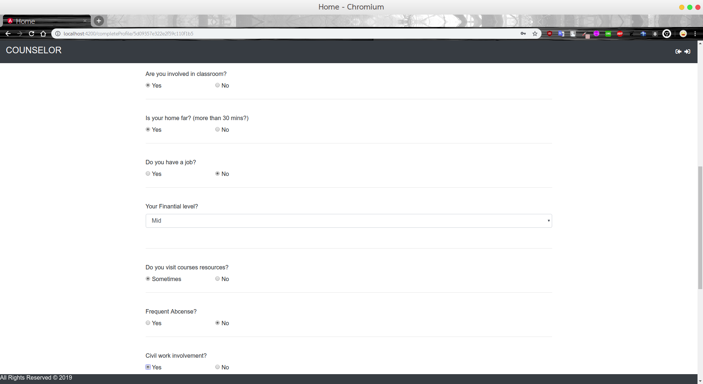
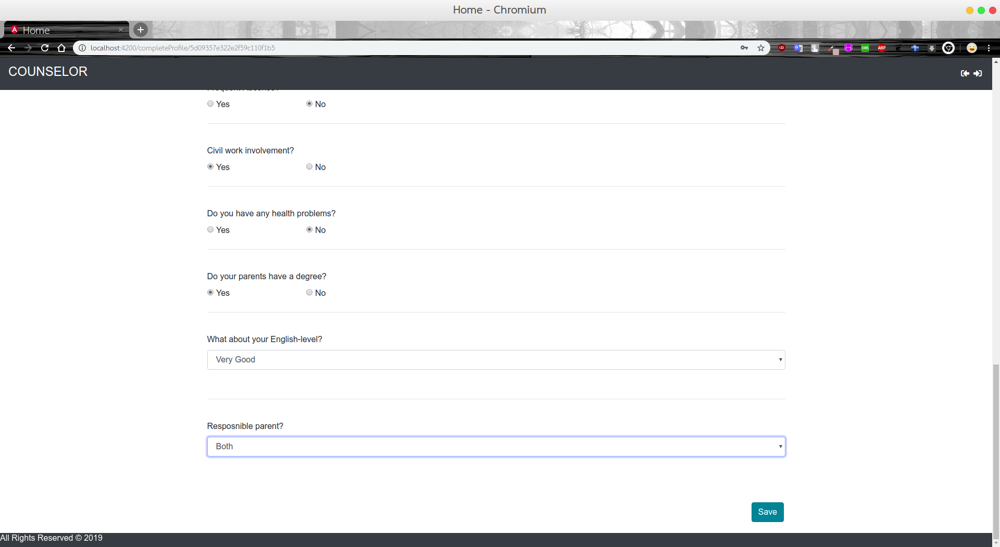
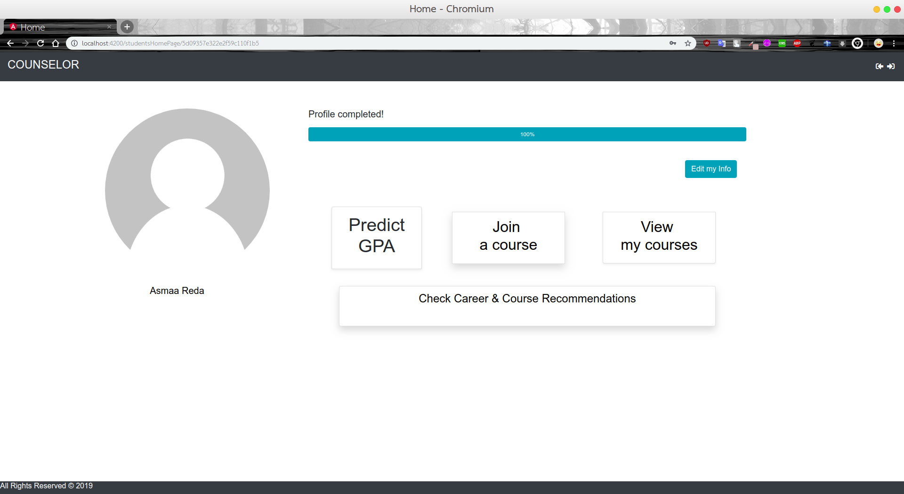
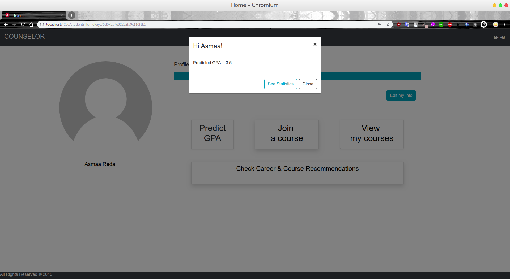
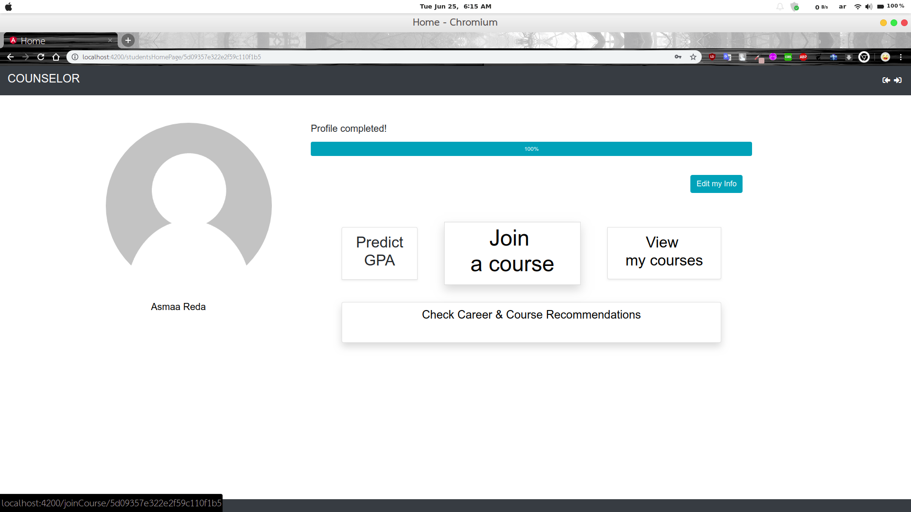
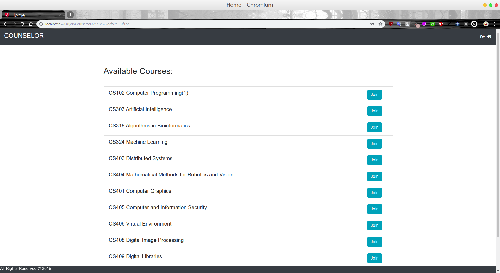

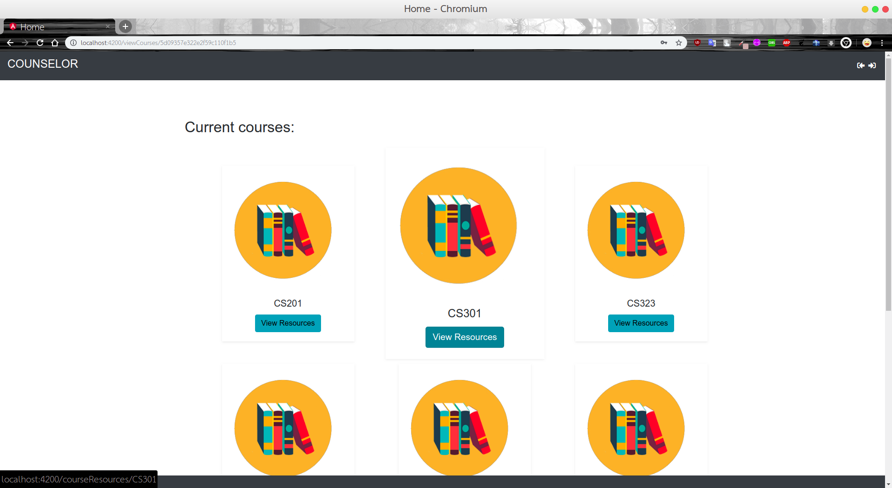
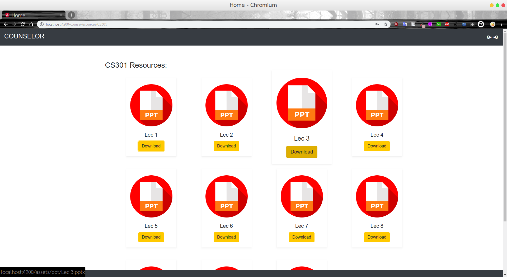
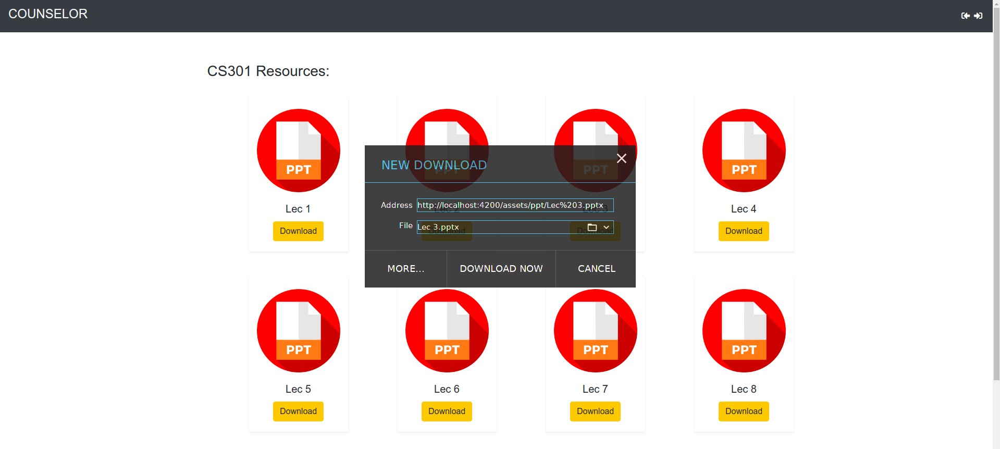
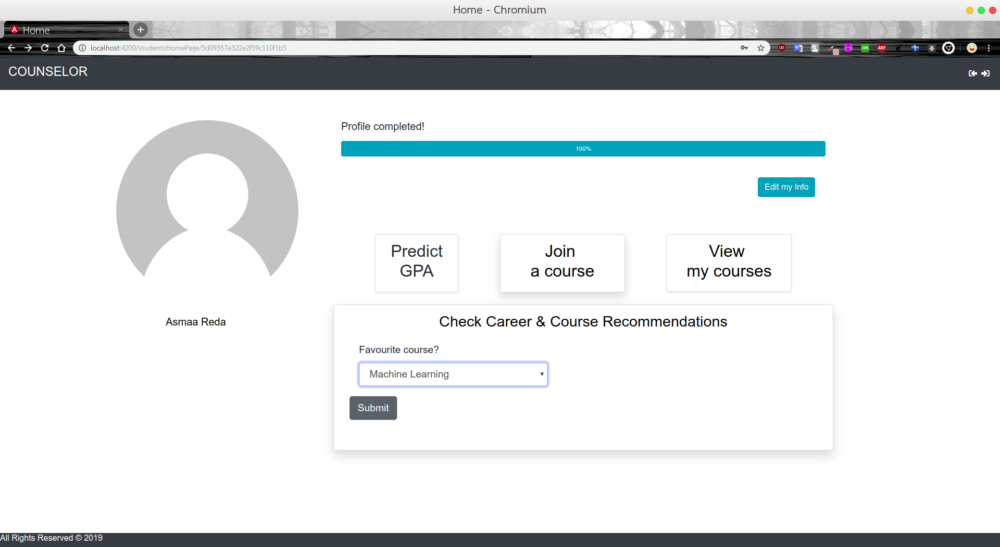
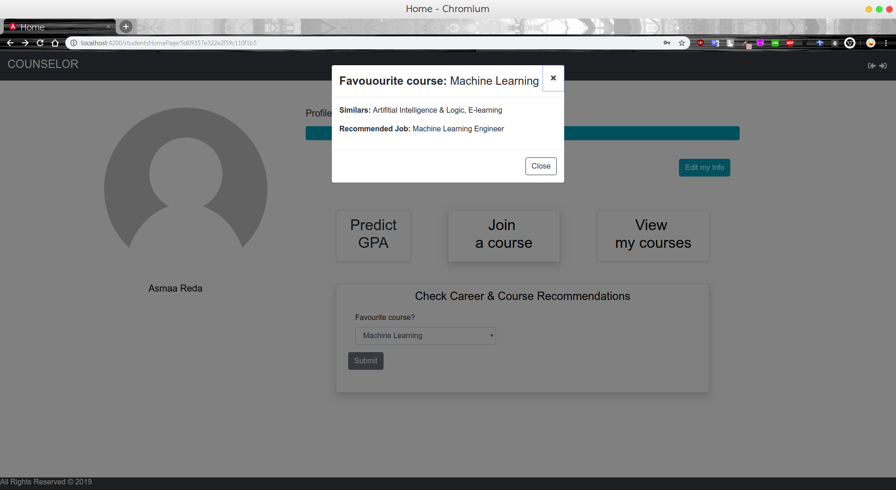
